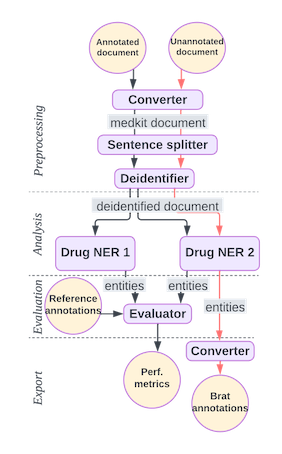
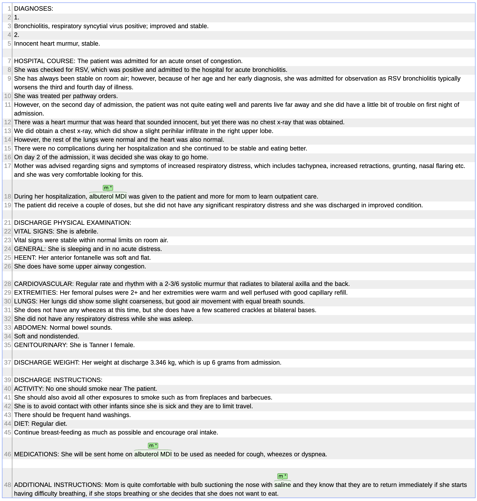
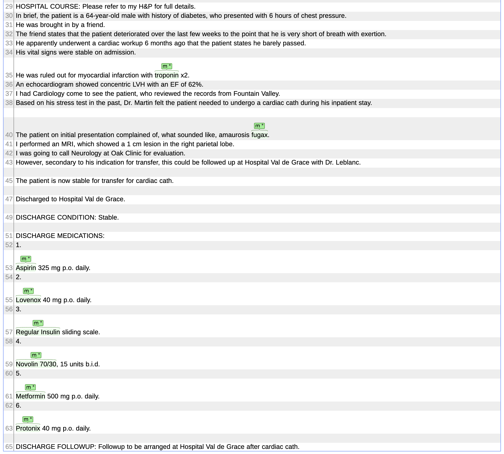

---
jupytext:
  formats: md:myst
  text_representation:
    extension: .md
    format_name: myst
kernelspec:
  display_name: Python 3
  language: python
  name: python3
metadata:
  execution:
    timeout: 300
---

# Comparative evaluation of drug recognition methods

This pipeline compares two tools (NER1 and NER2) for recognizing drug names in clinical texts,
compares their performance, and outputs two texts annotated with the tool evaluated as the best performer.

+++

## Overview of the pipeline

+++



+++

## Data preparation

+++

Download two clinical texts, with drug entites manually annotated.

```{code-cell} ipython3
import os
import tarfile
import tempfile
from pathlib import Path

# path to local data
extract_to = Path(tempfile.mkdtemp())
data_tarfile = Path.cwd() / "data.tar.gz"

# download and extract
tarfile.open(name=data_tarfile, mode="r|gz").extractall(extract_to)
data_dir = extract_to / "data"

print(f"Data dir: {data_dir}")
```

Read text documents with medkit

```{code-cell} ipython3
from medkit.core.text import TextDocument

doc_dir = data_dir / "mtsamplesen" / "annotated_doc"
docs = TextDocument.from_dir(path=doc_dir, pattern='[A-Z0-9].txt', encoding='utf-8')

print(docs[0].text)
```

## Pipeline definition

+++

Create and run a three-step doc pipeline that: 
1) Split sentences in texts
2) Run PII detection for deidentification
3) Recognize drug entities with NER1: a dictionnary-based approach named UMLSMatcher 
4) Recognize drug entities with NER2: a Transformer-based approach, see https://huggingface.co/samrawal/bert-large-uncased_med-ner

+++

### Sentence tokenizer

```{code-cell} ipython3
from medkit.text.segmentation import SentenceTokenizer

# By default, SentenceTokenizer will use a list of punctuation chars to detect sentences.
sentence_tokenizer = SentenceTokenizer(
    # Label of the segments created and returned by the operation
    output_label="sentence",
    # Keep the punctuation character inside the sentence segments
    keep_punct=True,
    # Also split on newline chars, not just punctuation characters
    split_on_newlines=True,
)
```

### PII detector

```{code-cell} ipython3
from medkit.text.deid import PIIDetector

pii_detector = PIIDetector(name="deid")
```

### Dictionnary-based drug recognizer

```{code-cell} ipython3
import shutil
from medkit.text.ner import UMLSMatcher

umls_data_dir = data_dir / "UMLS" / "2023AB" / "META"
umls_cache_dir = Path.cwd() / ".umls_cache"
shutil.rmtree(umls_cache_dir, ignore_errors=True)

umls_matcher = UMLSMatcher(
    # Directory containing the UMLS files with terms and concepts
    umls_dir=umls_data_dir,
    # Language to use (English)
    language="ENG",
    # Where to store the temp term database of the matcher
    cache_dir=umls_cache_dir,
    # Semantic groups to consider
    semgroups=["CHEM"],
    # Don't be case-sensitive
    lowercase=True,
    # Convert special chars to ASCII before matching
    normalize_unicode=True,
    name="NER1"
)
```

### Transformer-based drug recognizer

```{code-cell} ipython3
from medkit.text.ner.hf_entity_matcher import HFEntityMatcher

# an alternate model: "Clinical-AI-Apollo/Medical-NER"
bert_matcher = HFEntityMatcher(
    model="samrawal/bert-large-uncased_med-ner", name="NER2"
)
```

### Pipeline assembly

```{code-cell} ipython3
from medkit.core import DocPipeline, Pipeline, PipelineStep

pipeline = Pipeline(
    steps=[
        PipelineStep(sentence_tokenizer, input_keys=["full_text"], output_keys=["sentence"]),
        PipelineStep(pii_detector, input_keys=["sentence"], output_keys=["sentence_"]),
        PipelineStep(umls_matcher, input_keys=["sentence_"], output_keys=["ner1_drug"]),
        PipelineStep(bert_matcher, input_keys=["sentence_"], output_keys=["ner2_drug"]),
    ],
    input_keys=["full_text"],
    output_keys=["sentence_", "ner1_drug", "ner2_drug"],
)

doc_pipeline = DocPipeline(pipeline=pipeline)
doc_pipeline.run(docs)
```

### Performance evaluation

```{code-cell} ipython3
from medkit.io.brat import BratInputConverter

# Load text with annotations in medkit (our ground truth)
brat_converter = BratInputConverter()
ref_docs = brat_converter.load(doc_dir)

# Display selected drug annotations
for ann in ref_docs[0].anns.get(label="Drug"):
    print(f"{ann.text} in {ann.spans}")
```

```{code-cell} ipython3
## Compute some stats
print(f"Number of documents: {len(docs)}")
    
for i, doc in enumerate(docs):
    print(f"Document {doc.uid}:")

    # On annotations made by NER1 and NER2
    sentence_nb = len(doc.anns.get(label="sentence"))
    print(f"\t{sentence_nb} sentences,")
    ner1_drug_nb = len(doc.anns.get(label="chemical"))
    print(f"\t{ner1_drug_nb} drugs found with NER1,")  
    ner2_drug_nb = len(doc.anns.get(label="m"))
    print(f"\t{ner2_drug_nb} drugs found with NER2,")

    # On the manual annotation (our ground truth)
    gt_nb = len(ref_docs[i].anns.get(label="Drug"))
    print(f"\t{gt_nb} drugs manually annotated.")
```

```{code-cell} ipython3
## Evaluate performance metrics of the NER1 and NER2 tools
from medkit.text.metrics.ner import SeqEvalEvaluator
import pandas as pd

def results_to_df(_results, _title):
    results_list = list(_results.items())
    arranged_results = {"Entities": ['P', 'R', 'F1']}
    accuracy = round(results_list[4][1], 2)

    for i in range(5, len(results_list), 4):
        key = results_list[i][0][:-10]
        arranged_results[key] = [round(results_list[n][1], 2) for n in [i, i + 1, i + 2]]

    df = pd.DataFrame(arranged_results, index=[f"{_title} (acc={accuracy})", '', '']).T
    return df

predicted_entities1=[]
predicted_entities2=[]
dfs = []

for doc in docs:
    predicted_entities1.append(doc.anns.get(label="chemical"))
    predicted_entities2.append(doc.anns.get(label="m"))

# Annotations of NER1 are labelled as 'chemical', NER2 as 'm', but as 'Drug' in the ground truth
# The following dic enables remappings various labels of the same type of entites
remapping= {"chemical": "Drug", "m": "Drug"}
evaluator = SeqEvalEvaluator(return_metrics_by_label=True, average='weighted', labels_remapping=remapping) 
# eval of NER2
results1 = evaluator.compute(ref_docs, predicted_entities1)
dfs.append(results_to_df(_results=results1, _title="NER1"))
#print(results_to_df(_results=results1, _title="umls_matcher"))
# eval of NER2
results2 = evaluator.compute(ref_docs, predicted_entities2)
dfs.append(results_to_df(_results=results2, _title="NER2"))

print(pd.concat(dfs, axis=1))
```

```{code-cell} ipython3
## Read new unannotated documents
## Write annotations of tool NER2 in the brat format
from medkit.io.brat import BratOutputConverter

in_path = data_dir / "mtsamplesen" / "unannotated_doc"
# reload raw documents
final_docs = TextDocument.from_dir(
    path=Path(in_path),
    pattern='[A-Z0-9].txt',
    encoding='utf-8',
)
# simplified pipeline, with only the best NER tool (NER2)
pipeline2 = Pipeline(
    steps=[
        PipelineStep(
            sentence_tokenizer,
            input_keys=["full_text"],
            output_keys=["sentence"],
        ),
        PipelineStep(
            pii_detector,
            input_keys=["sentence"],
            output_keys=["sentence_"],
        ),
        PipelineStep(
            bert_matcher,
            input_keys=["sentence_"],
            output_keys=["ner2_drug"],
        ),
    ],
    input_keys=["full_text"],
    output_keys=["ner2_drug"],
)

doc_pipeline2 = DocPipeline(pipeline=pipeline2)
doc_pipeline2.run(final_docs)

# filter annotations to keep only drug annotations
# sensitive information can also be removed here
output_docs = [
    TextDocument(text=doc.text, anns=doc.anns.get(label="m"))
    for doc in final_docs
]

# Define Output Converter with default params,
# transfer all annotations and attributes
brat_output_converter = BratOutputConverter()
out_path = data_dir / "mtsamplesen" / "ner2_out"

# save the annotation with the best tool (considering F1 only) in `out_path`
brat_output_converter.save(
    output_docs, 
    dir_path=out_path,
    doc_names=["ner2_6", "ner2_7"],
)
```

Annotations of the discharge summary 6.txt, displayed with Brat



+++

Annotations of the discharge summary 7.txt (partial view), displayed with Brat


